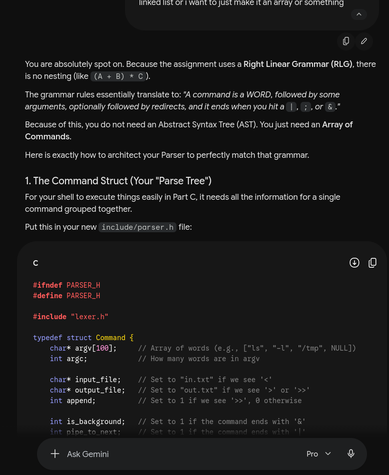

```LINE  ->  ε
      |   WORD ARG

ARG   ->  ε
      |   WORD    ARG
      |   OP_LT   TGT
      |   OP_GT   TGT
      |   OP_GTGT TGT
      |   OP_PIPE CMD
      |   OP_SEMI CMD
      |   OP_AMP  BG

CMD   ->  WORD ARG

TGT   ->  WORD ARG

BG    ->  ε
      |   WORD ARG
ok that  worked  above is the grammar how am i supposed to make a parser, since its rlg the parse tree is actually a parse linked list or i want  to just make it an array or something```



used this prompt to understand how i would convert the given grammar to parser had some intution but the actual implementation was  not clicking the struct idea given by AI helped a lot