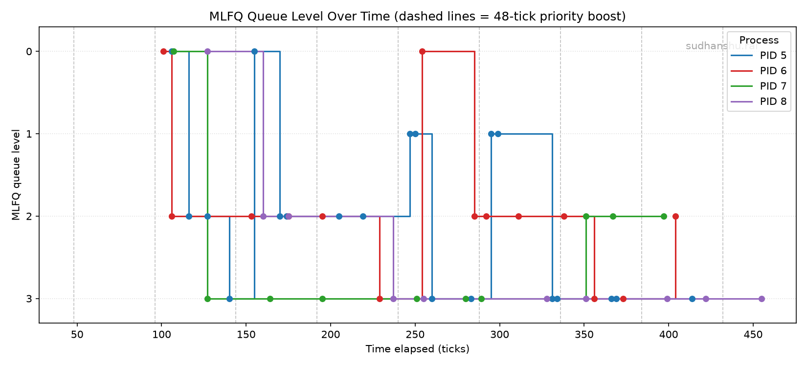
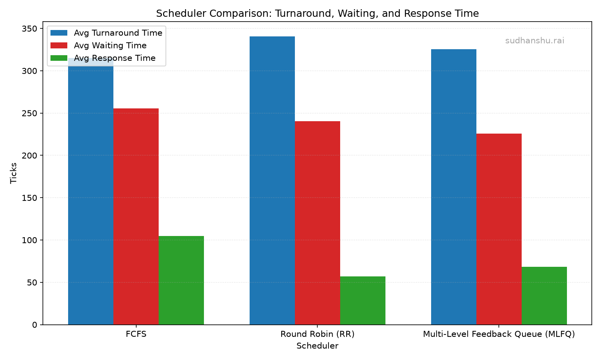

# Changes
## Kernel
### defs.h
Added the declaration for schdeuler mlfq and getqueue since get queue is a syscall it needs to be declared and scheduler mlfq needed to have its no return added
### proc.c
The place with most of the code it contains several functions 
Implementing the queue using the modulo rotating pointers and not the actual queue data structure
1. push used to push the jobs into the queues, has 2 mode one is to push to tail side to  act out new process being  added and one to push to head to put a process not done with its quanta back into the queue at the start or head position
2. pop used to remove the head job from the queue which it is asked to remove from
3. added the mlfq lock to make sure the scheduler queue properties of the proc cannot be updated without it
4. added a new scheduler_mlfq and yield_mlfq which implements the 5 rules of mlfq
5. added the procdump in the exact format asked for and added the queue number and number of ticks used in that queue as well
### proc.h
changed the proc struct to have the mlfq required properties of inq, queue and tick
###  syscall.c
declared the getqueue syscall call so the m_getqueue can be used
### syscall.h
defined the syscall number
### sysproc.c
setup the syscall to call the m_getqueue
## User
### user.h
added a small  declaration for getqueue
### usys.pl
added the entry point for getqueue
### schedulertest
created a testing binary which tests the scheduler by checking the response times using the 4 child processes with required  tick times  and io interrupt and  everything to get the time charts for the schedulers comparision

# Comparision
The actual outputs are in a different file called logs the same results are used to make the graphs here

## Line chart

## Bar Graph

## Discussion
As we can see from the observation data and the  graphs the fcfs  has the better TAT while having horrendous  Response whereas the inverse applies to RR this is because FCFS does not care about fairness or response all it cares about is getting the job done faster where as RR only cares about response time while the final TAT for RR does depend on an RR if the quanta is too big  it just becomes FCFS and if it is too small it just has too many context switched destroying TAT in the name of response hence MLFQ is the middle ground between the 2 which gives us the best of both worlds gives us a respectable TAT and response by having different quanta at different queue levels and the  moving of processes between levels accounts for that even  further.